# 기사 사용 메뉴얼

셔틀이에서 운행을 담당하는 기사를 위한 사용 안내서입니다. 스마트폰(안드로이드 권장) 사용을 전제로 합니다. iPhone 사용 시 주의사항은 마지막 섹션에서 따로 안내합니다.

> 📌 **시작 전 안내**: 학원·기관에서 SMS·카카오톡으로 보낸 **초대 링크**가 있어야 가입할 수 있습니다. 링크가 없으시면 학원장에게 요청해 주세요.

## 목차

1. [가입과 로그인](#1-가입과-로그인)
2. [오늘의 운행 화면 (/run)](#2-오늘의-운행-화면-run)
3. [운행 시작과 권한 허용](#3-운행-시작과-권한-허용)
4. [운행 화면 구조 한눈에 보기](#4-운행-화면-구조-한눈에-보기)
5. [출발 전 안전점검 (어린이용 차량)](#5-출발-전-안전점검-어린이용-차량)
6. [동승보호자 지정](#6-동승보호자-지정)
7. [정류장 자동 통과](#7-정류장-자동-통과)
8. [학생 탑승·하차 처리](#8-학생-탑승하차-처리)
9. [미탑승·미하차 보고](#9-미탑승미하차-보고)
10. [운행 종료](#10-운행-종료)
11. [알림 화면](#11-알림-화면)
12. [iPhone 사용자 주의사항](#12-iphone-사용자-주의사항)

---

## 1. 가입과 로그인

### 1.1 초대 링크로 가입

학원에서 받은 초대 링크를 누르면 가입 화면으로 이동합니다.

1. **로그인 아이디**를 정합니다 — 영문·숫자·밑줄(\_)로 4~20자 (예: `kim_driver`).
2. **비밀번호** — 8자 이상.
3. **복구용 이메일**(선택) — 비밀번호를 잊었을 때 재설정 메일을 받는 주소.
4. 가입 완료 → 자동 로그인 → 오늘의 운행 화면으로 이동.

> 💡 **로그인 아이디는 신중하게**: 한 번 정하면 변경이 어렵습니다. 학원장과 상의해 두는 것을 권합니다.

### 1.2 다음부터 로그인하기

- 첫 칸: 로그인 아이디
- 둘째 칸: 비밀번호
- **로그인** 버튼

---

## 2. 오늘의 운행 화면 (/run)

로그인하면 처음 보이는 화면입니다. 오늘 배정된 운행 카드가 보입니다.

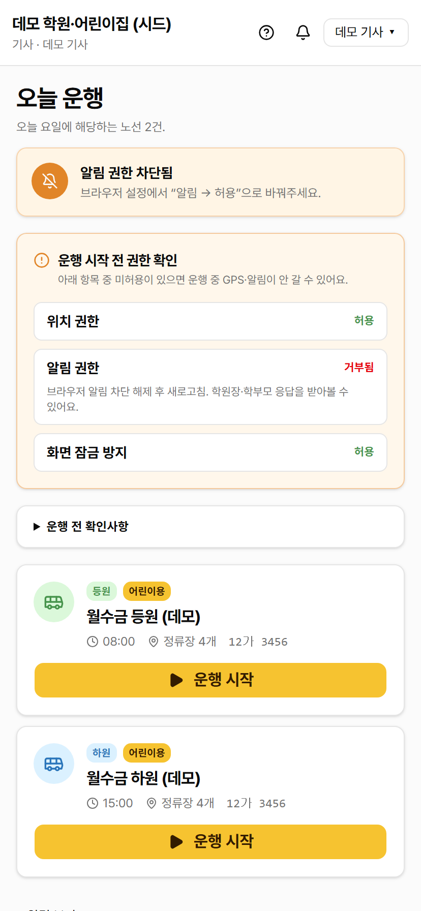

- **위쪽 헤더** — 학원 이름·내 계정·알림 벨·도움말
- **가운데** — 오늘 운행 카드 (등원·하원 노선별 1장)
- 카드 아래 **운행 시작** 버튼

---

## 3. 운행 시작과 권한 허용

### 3.1 권한 사전 체크

운행을 시작하기 전에 **위치(GPS)·알림·화면 자동 꺼짐 방지** 권한이 정상 동작하는지 셔틀이가 미리 확인합니다.

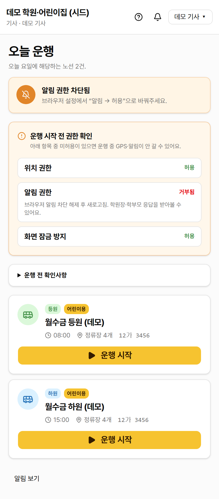

문제가 있으면 어떻게 해결해야 하는지 안내가 표시됩니다. 문제 없으면 **운행 시작** 버튼이 활성화됩니다.

### 3.2 위치·알림 권한 허용

**운행 시작** 버튼을 누르면 브라우저가 권한을 묻습니다. 모두 **허용**을 눌러 주세요.

- **위치(GPS) 허용** — 학부모·학원장에 셔틀의 실시간 위치를 보내는 데 필수.
- **알림 허용** — 학부모가 보낸 결석 통보, 학원장이 보낸 메시지를 받는 데 필수.

> ⚠️ **거부하면 안 됩니다**: 위치를 거부하면 학부모 화면에 셔틀이 보이지 않습니다. 알림을 거부하면 학생의 결석 통보를 못 받아 미탑승으로 잘못 처리될 수 있습니다.

> 💡 **이미 거부했다면**: 브라우저 주소창 옆 자물쇠 아이콘 → 사이트 설정에서 **위치·알림 → 허용**으로 다시 바꿔 주세요.

---

## 4. 운행 화면 구조 한눈에 보기

운행을 시작하면 검은 그라데이션 헤더와 정류장 진행도가 있는 운행 화면으로 이동합니다.

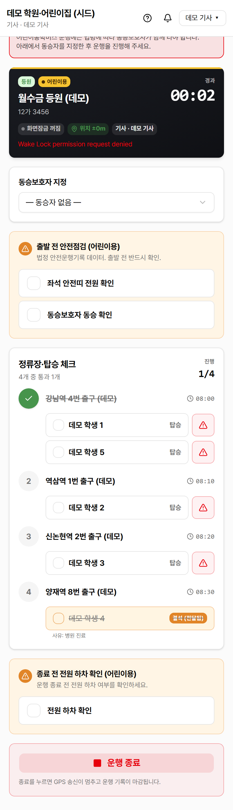

위에서부터:

1. **검은 그라데이션 헤더** — 노선 이름, 차량 번호, 운행 경과 시간 (00:00 → 운행 끝까지 카운트)
2. **상태 표시 칩** — 화면 잠금 상태, GPS 정확도, 동승보호자 이름
3. **(어린이용 차량만)** 출발 전 안전점검 카드
4. **(어린이용 차량만)** 동승보호자 지정 영역
5. **정류장 진행도 + 학생 명단** — 정류장마다 학생 명단이 펼쳐짐
6. **운행 종료** 버튼

### 헤더의 상태 표시 칩

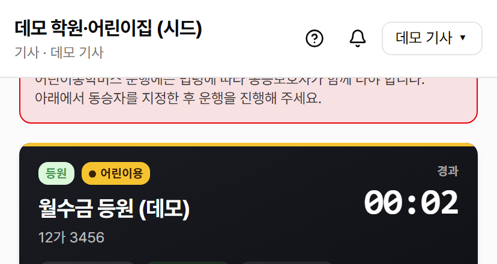

- **화면잠금 켜짐** — 운행 중 화면이 자동으로 꺼지지 않게 잠금 (안드로이드만 동작)
- **위치 ±N m** — 지금 GPS 정확도. N이 작을수록 정확. 50m 이하면 정상.
- **기사·동승** — 본인 이름과 지정된 동승보호자

---

## 5. 출발 전 안전점검 (어린이용 차량)

어린이용 차량(13세 미만 학생이 한 명이라도 탄 차량)은 출발 전에 안전점검 체크가 필수입니다.

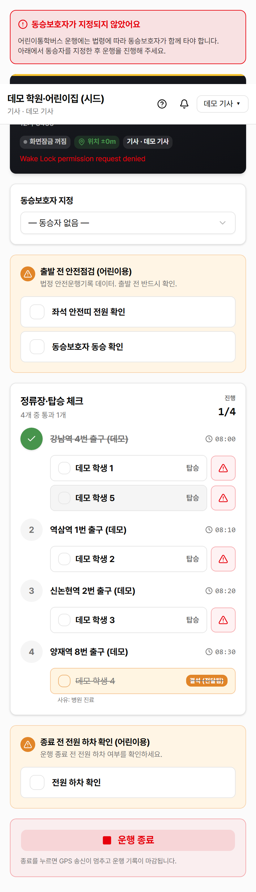

1. **좌석 안전띠 전원 확인** — 모든 학생이 안전띠를 했는지 확인 후 체크.
2. **동승보호자 동승 확인** — 동승보호자가 함께 타고 있는지 확인 후 체크.

체크하는 즉시 안전운행기록(분기별 PDF)에 자동으로 누적됩니다.

> ⚠️ **법적 근거**: 도로교통법은 어린이통학버스 운행 시 좌석안전띠 착용·동승보호자 동승을 의무로 정합니다.

---

## 6. 동승보호자 지정

어린이용 차량은 **동승보호자(헬퍼) 지정**이 필수입니다.

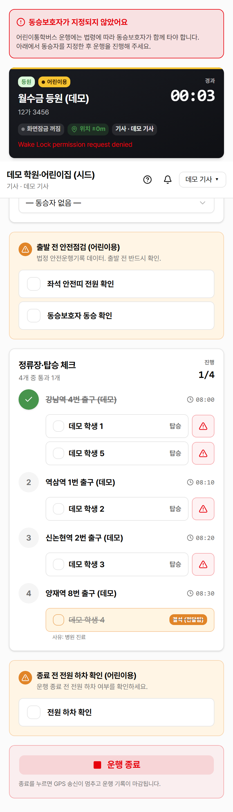

학원장이 미리 등록한 동승보호자 직원 명단에서 오늘 함께 타는 분을 선택합니다.

> ⚠️ **동승보호자 없는 어린이용 운행은 위반**: 셔틀이는 운행 시작 자체는 막지 않지만, 동승보호자 미지정 상태로 운행하면 **사고 시 면책 자료가 무효**가 됩니다. 반드시 지정해 주세요.

---

## 7. 정류장 자동 통과

GPS가 정류장 반경 50m 안에 들어오면 셔틀이가 자동으로 **통과** 표시를 합니다.

- **통과한 정류장**: 회색 + 취소선
- **다음 정류장**: 강조 색

운행 후 안전운행기록 PDF에는 정류장별 통과 시각이 자동으로 기록됩니다.

---

## 8. 학생 탑승·하차 처리

각 정류장 아래로 그 정류장에서 타고 내리는 학생 명단이 펼쳐집니다.

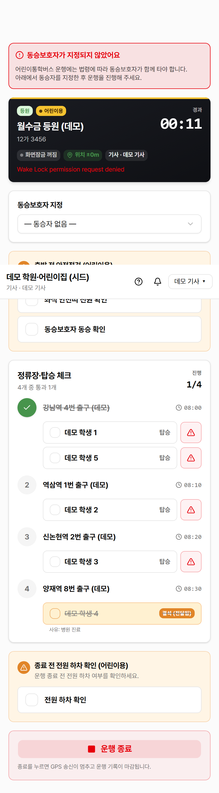

학생 칸을 한 번 누르면:

- **등원 운행** — **탑승 완료**(✓) 처리
- **하원 운행** — **하차 완료**(✓) 처리

다시 누르면 ✓ 해제. 마지막 한 번 더 확인하고 싶을 때 사용.

### 결석 신청된 학생

학부모가 결석을 신청한 학생은 자동으로 **회색 + "결석" 뱃지**로 표시되고 사유가 함께 보입니다.

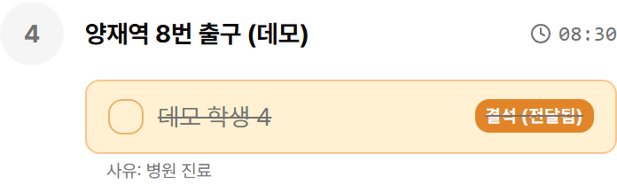

> 💡 결석 학생도 탑승 토글은 가능합니다 — 학부모가 마지막에 사정이 바뀌어 셔틀을 태울 수도 있기 때문입니다.

### 60초 미처리 학생 강조

정류장을 지난 뒤 60초 동안 처리(탑승 ✓ 또는 미탑승 보고)가 안 된 학생은 **노란 깜빡임 + "처리 누락"** 뱃지로 강조됩니다. 학생을 깜빡 잊었을 때 다층 안전망 역할을 합니다.

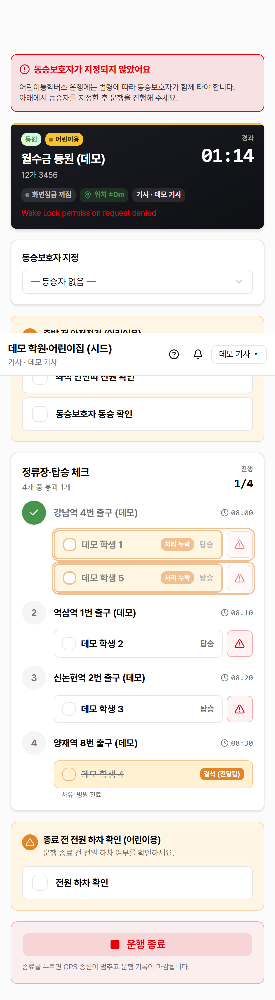

---

## 9. 미탑승·미하차 보고

학생이 정류장에 안 나오거나 셔틀에서 못 내린 경우 학생 옆 **빨간 ⚠️ 버튼**을 누릅니다.

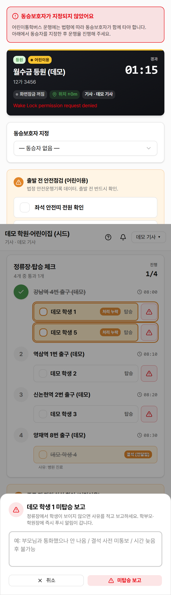

1. ⚠️ 버튼 → 사유 입력 모달이 뜸.
2. **사유**를 짧게 입력 (예: "부모님과 통화했으나 안 나옴", "결석 사전 통보 못 받음").
3. **미탑승 보고** 버튼 → 학부모와 학원장에 즉시 푸시 알림.

> ⚠️ **미하차(NO_DROPOFF)는 매우 심각**: 학생이 셔틀에서 못 내린 경우입니다 (잠들어 있음, 보호자 미도착 등). 사유와 후속 조치(예: "학원으로 복귀", "보호자 추가 통화")를 반드시 적어 주세요.

---

## 10. 운행 종료

화면 가장 아래의 **운행 종료** 빨간 버튼을 누릅니다.

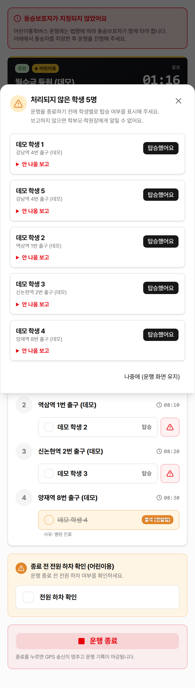

### 미처리 학생 강제 확인

미처리 학생(탑승 ✓ 안 했고 미탑승 보고도 안 한 학생)이 남아 있으면 종료를 막고 강제 확인 모달이 뜹니다.

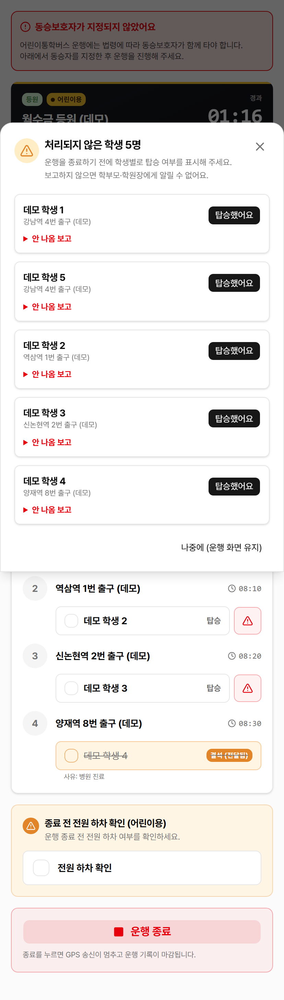

학생별로 **[탑승 처리]** 또는 **[미탑승 보고]** 중 하나를 선택해야 운행을 종료할 수 있습니다. 이는 미탑승을 깜빡 빠뜨리는 사고를 막기 위한 안전망입니다.

### 어린이용 차량 — 전원 하차 확인

어린이용 차량은 운행 종료 직전에 **"전원 하차 확인"** 체크가 필수입니다. 학생이 셔틀에 남아 있지 않은지 마지막으로 확인합니다.

운행 종료를 누르면:

- GPS 위치 송신이 즉시 중단됩니다 (학부모 화면 마커 사라짐).
- 운행 기록이 마감되고 안전운행기록 PDF에 자동 누적됩니다.

---

## 11. 알림 화면

상단 헤더의 종 모양 아이콘에서 받은 알림 목록을 확인합니다.

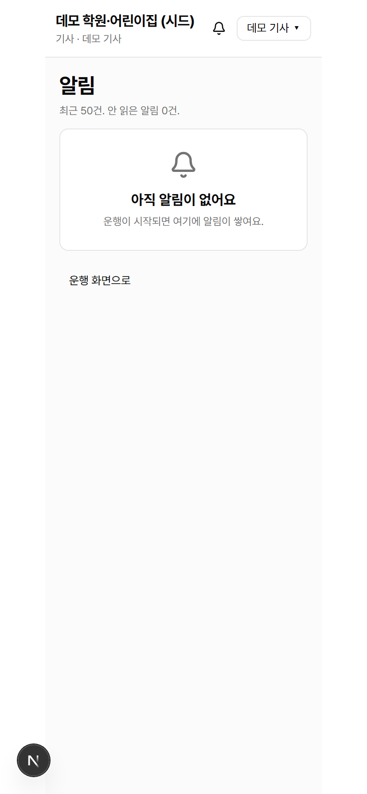

알림 종류:
- **결석 통보** — 학원장이 결석 신청을 전달함
- **학부모 응답** — "지금 데려다 드릴게요" 같은 응답
- **공지** — 학원장이 보낸 공지

---

## 12. iPhone 사용자 주의사항

iPhone Safari는 운영체제 제약으로 **백그라운드 GPS가 거의 동작하지 않습니다**. 화면을 잠그거나 다른 앱을 켜면 위치 송신이 멈춥니다.

### 권장 조치

1. **거치대 + 충전기** 필수 — 화면 켠 채로 운행.
2. **화면 자동 꺼짐 방지** 기능이 동작하지 않으므로 운행 중 화면이 꺼지지 않도록 수시로 화면을 톡 누르기.
3. 가능하면 **안드로이드 폰**으로 교체 — 화면 자동 꺼짐 방지가 정상 동작.

> 📌 베타 기간에는 안드로이드 폰을 권장합니다. iPhone 전용 네이티브 앱은 추후 출시 예정입니다.

---

문의·도움 요청은 학원장에게 전달해 주세요.
