# 학부모 사용 메뉴얼

자녀가 셔틀버스를 이용하는 학부모를 위한 가이드. 모바일 사용을 전제로 합니다.

> 📌 **전제**: 학원·기관에서 학부모 초대 URL을 보내야 가입 가능합니다. SMS·카카오톡으로 받은 URL부터 시작합니다.

## 목차

1. [가입·로그인](#1-가입로그인)
2. [홈 화면 둘러보기](#2-홈-화면-둘러보기)
3. [PWA 설치](#3-pwa-설치)
4. [알림 권한 켜기](#4-알림-권한-켜기)
5. [운행 카드 종류](#5-운행-카드-종류)
6. [운행 중 화면 (trip-live)](#6-운행-중-화면-trip-live)
7. [자녀 정류장 도착 예상](#7-자녀-정류장-도착-예상)
8. [정류장 진행도](#8-정류장-진행도)
9. [기사에 직접 통화](#9-기사에-직접-통화)
10. [알림 화면](#10-알림-화면)
11. [미탑승 응답 ("지금 데려다 드릴게요")](#11-미탑승-응답)
12. [결석 신청](#12-결석-신청)
13. [정류장 변경 요청](#13-정류장-변경-요청)
14. [신청 현황 카드](#14-신청-현황-카드)
15. [BottomTabBar 4탭](#15-bottomtabbar-4탭)

---

## 1. 가입·로그인

### 1.1 토큰 가입

학원·기관에서 보낸 초대 URL(`/parent-invite/[token]`) 클릭.

1. **이름·전화번호** 자동 입력 (학원에서 등록한 정보)
2. **로그인 ID** 정하기 (영문·숫자·_, 4~20자)
3. 비밀번호 (8자 이상)
4. **복구 이메일** (선택)
5. 가입 → 자동 로그인 → 홈 화면

### 1.2 로그인

`/login`에서 로그인 ID + 비밀번호.

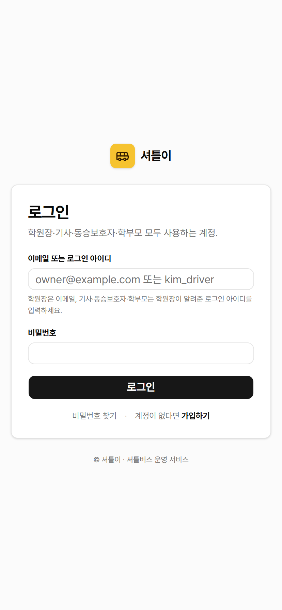

---

## 2. 홈 화면 둘러보기

`/home` — 자녀별 오늘 운행 카드, 결석 미리보기, 신청 현황.

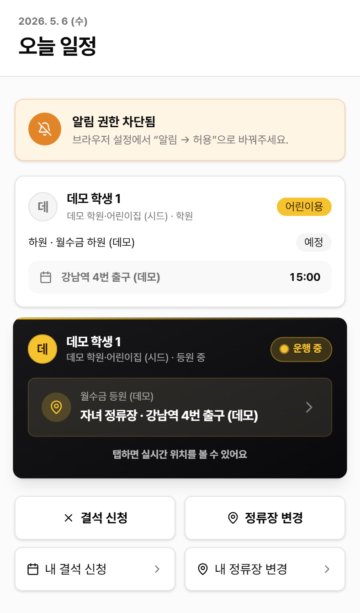

### 2.1 인사말 + 푸시 알림 토글

날짜 + "오늘 일정" 헤더. 그 아래 푸시 알림 토글.

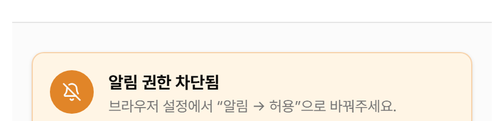

---

## 3. PWA 설치

### 3.1 안드로이드 (Chrome)

브라우저 자동으로 "홈 화면에 추가" 안내 배너 표시. 터치 한 번으로 설치 완료.

### 3.2 iOS (Safari)

수동 설치 안내가 표시됩니다. 공유 버튼 → "홈 화면에 추가" 단계.

> 💡 **TIP**: PWA로 설치하면 홈 화면 아이콘에서 직접 실행 가능. 푸시 알림 받기에도 더 안정적입니다.

---

## 4. 알림 권한 켜기

푸시 토글 ON → 브라우저 권한 popup → "허용".

권한 허용 후 토글 색상 변경 + 디바이스 등록.

> ⚠️ **WARNING**: 거부 시 NO_SHOW(자녀가 정류장에 안 나옴)·정류장 도착 임박 알림을 못 받습니다.

---

## 5. 운행 카드 종류

자녀별로 등원·하원 노선 + 4가지 상태가 있습니다.

### 5.1 운행 중 (LiveTripCard)

- 검은 그라데이션 + 노란 stripe
- 카드 탭 → trip-live 풀스크린

### 5.2 운행 예정

- 회색 카드, 첫 정류장 예정 시각 표시

### 5.3 운행 완료

- 종료 시각 표시. 탭 시 운행 요약 화면

### 5.4 운행 없음

- 자녀가 노선에 미배정 (`no_route`) 또는 오늘 요일 미운행 (`off_day`)

---

## 6. 운행 중 화면 (trip-live)

운행 중 카드 탭 → `/trip-live/[tripId]` 풀스크린.

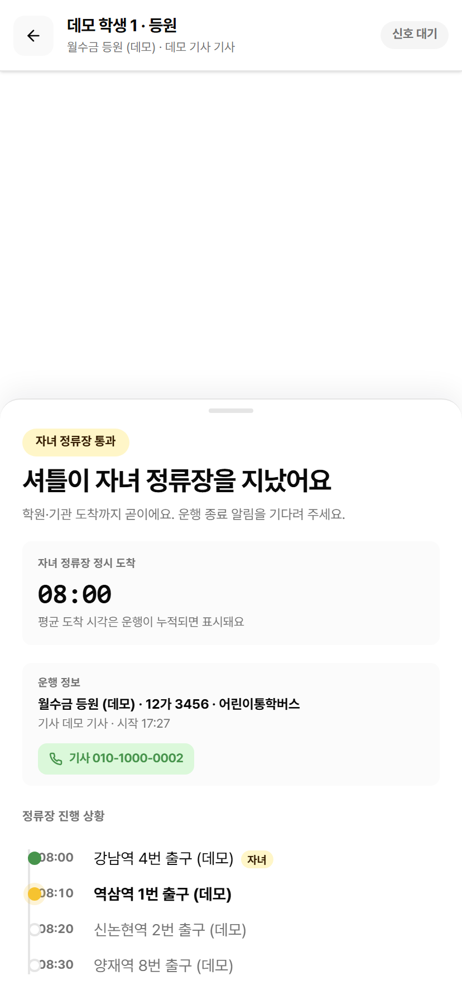

### 6.1 헤더

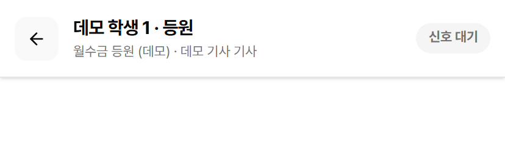

자녀 이름 + 등원/하원 + 노선 + 기사. **LIVE 점등** = GPS 수신 중.

### 6.2 지도

카카오맵 + 셔틀 마커(노란 버스 아이콘) + 정류장 마커(자녀 정류장 강조).

5초마다 셔틀 마커 위치 자동 갱신.

---

## 7. 자녀 정류장 도착 예상

운행 누적 데이터(최근 5건+)를 학습한 평균을 기반으로 도착 예상 시각 표시.

데이터 부족 시 노선 정시 도착 시각 표시:

> 💡 **TIP**: "정시보다 +3분" 같은 표시는 최근 운행 평균 기반. 운행이 누적될수록 정확해집니다.

---

## 8. 정류장 진행도

자녀 정류장이 강조된 timeline. 통과한 정류장은 ✓, 다음 정류장은 강조 색.

자녀 정류장 도착 임박(반경 진입) 시 자동 푸시 알림 (`SHUTTLE_NEAR_CHILD`).

---

## 9. 기사에 직접 통화

운행 중 화면에 기사 번호로 직접 전화 CTA.

긴급 상황(자녀 잠듦, 위치 변경 부탁) 시 한 번 탭으로 통화.

---

## 10. 알림 화면

`/notifications` — 푸시로 받은 알림 list.

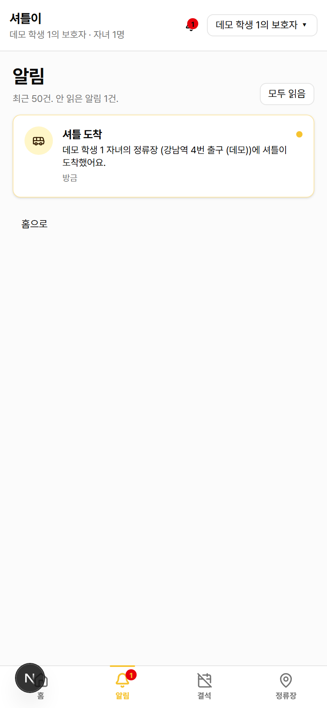

알림 종류:
- **SHUTTLE_NEAR_CHILD** — 자녀 정류장 도착 임박
- **NO_SHOW** — 자녀가 정류장에 안 나타남 (기사 보고)
- **STOP_CHANGE_APPROVED/REJECTED** — 정류장 변경 승인/반려
- **ABSENCE_NOTIFIED** — 결석 신청이 기사에 전달됨

---

## 11. 미탑승 응답

NO_SHOW 알림이 오면 알림 카드 안에 "지금 데려다 드릴게요" / "결석으로 처리" 버튼.

응답 즉시 학원장 dashboard에 반영 + 기사 폰에도 통보.

---

## 12. 결석 신청

`/my-absences/new` — BottomTabBar의 "결석" 탭 → "+ 결석 신청".

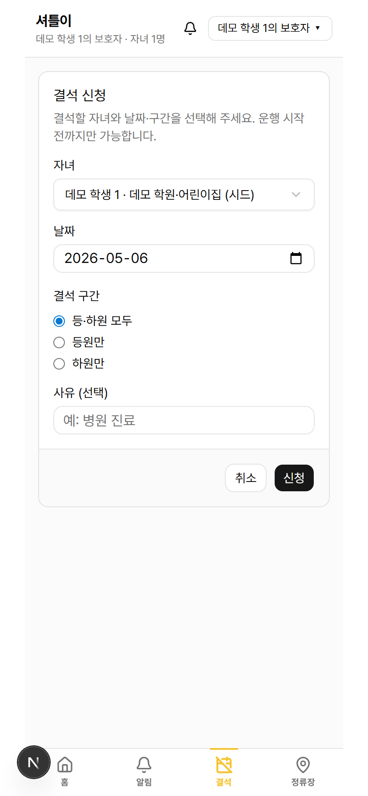

1. 자녀 선택
2. 날짜 (오늘부터 미래)
3. 결석 구간: 등·하원 모두 / 등원만 / 하원만
4. 사유 (선택)

신청 시 학원장 dashboard에 PENDING 표시 + 푸시.

`/my-absences` — 신청 history.

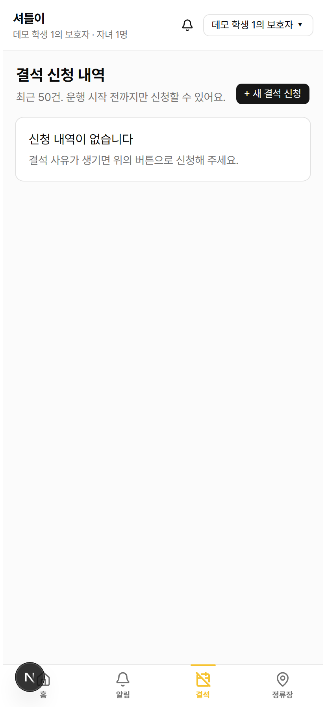

---

## 13. 정류장 변경 요청

`/my-stop-changes/new` — 자녀가 타고 내리는 정류장을 옮기고 싶을 때.

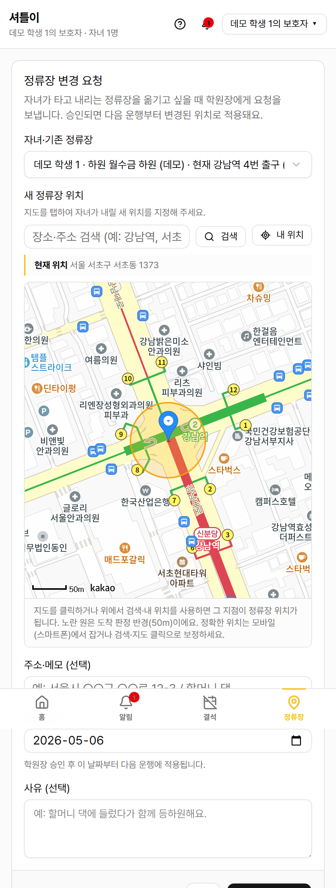

1. 자녀·기존 정류장 선택
2. 지도 클릭으로 새 위치 지정
3. 적용 일자 선택
4. 사유 (선택)

승인되면 그 일자부터 다음 운행에 반영.

`/my-stop-changes` — 요청 history.

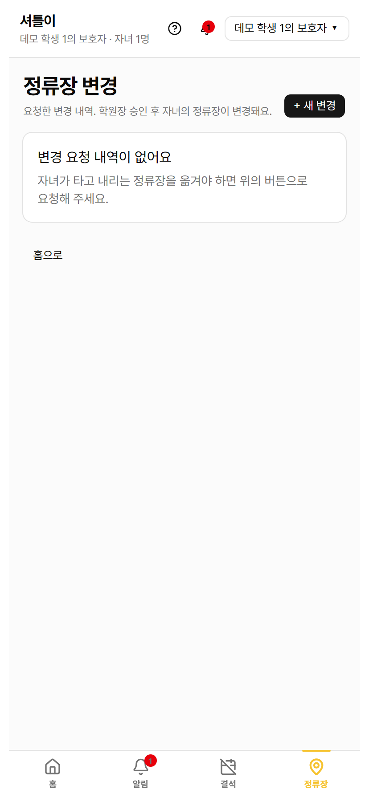

---

## 14. 신청 현황 카드

홈 화면 actions grid에 대기 중 카운트 배지.

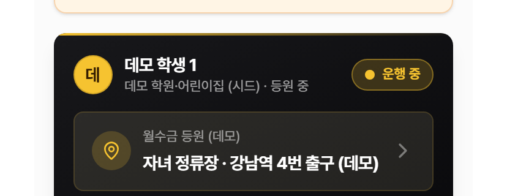

결석·정류장 변경 PENDING 건수가 한눈에 보임.

---

## 15. BottomTabBar 4탭

화면 하단 고정 4탭.

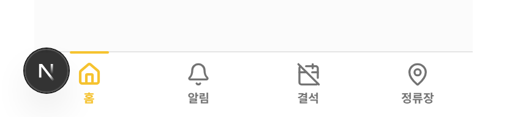

- **홈** — `/home`
- **알림** — `/notifications` (안 읽은 카운트 뱃지)
- **결석** — `/my-absences`
- **정류장** — `/my-stop-changes`
