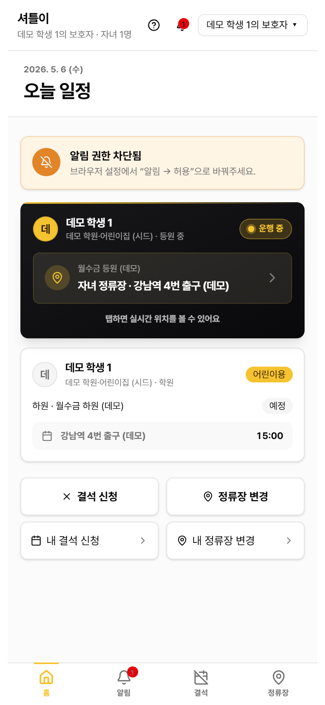
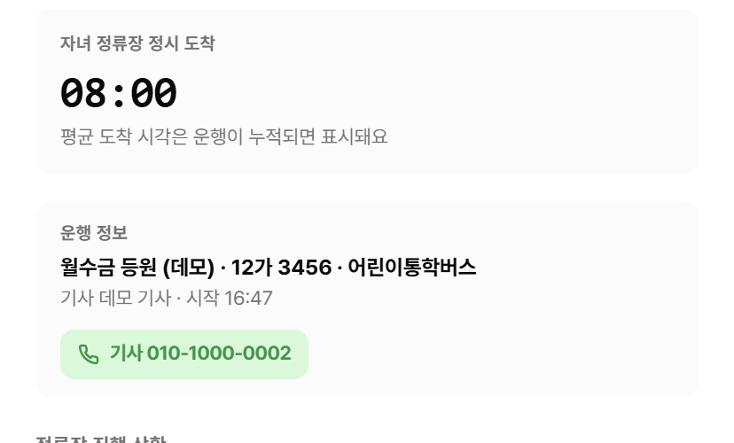

# 학부모 사용 메뉴얼

자녀가 셔틀버스를 이용하는 학부모를 위한 사용 안내서입니다. 스마트폰 사용을 전제로 합니다.

> 📌 **시작 전 안내**: 학원·기관에서 SMS·카카오톡으로 보낸 **초대 링크**가 있어야 가입할 수 있습니다. 링크가 없으시면 학원·기관에 문의해 주세요.

## 목차

1. [가입과 로그인](#1-가입과-로그인)
2. [홈 화면 둘러보기](#2-홈-화면-둘러보기)
3. [푸시 알림 켜기](#3-푸시-알림-켜기)
4. [오늘의 운행 카드](#4-오늘의-운행-카드)
5. [운행 중 셔틀 위치 보기](#5-운행-중-셔틀-위치-보기)
6. [자녀 정류장 도착 예상 시각](#6-자녀-정류장-도착-예상-시각)
7. [정류장 진행 상황](#7-정류장-진행-상황)
8. [기사에게 직접 통화](#8-기사에게-직접-통화)
9. [알림 받아 보기](#9-알림-받아-보기)
10. [결석 신청](#10-결석-신청)
11. [정류장 변경 요청](#11-정류장-변경-요청)
12. [내 신청 현황 확인](#12-내-신청-현황-확인)
13. [화면 아래 4개 탭 메뉴](#13-화면-아래-4개-탭-메뉴)

---

## 1. 가입과 로그인

### 1.1 초대 링크로 가입

학원·기관에서 받은 초대 링크를 누르면 가입 화면으로 이동합니다.

1. **이름·전화번호**가 자동으로 입력되어 있습니다 (학원에서 등록한 정보).
2. **로그인 아이디**를 정합니다 — 영문·숫자·밑줄로 4~20자 (예: `mom_kim`).
3. **비밀번호** — 8자 이상.
4. **복구용 이메일**(선택) — 비밀번호를 잊었을 때 사용.
5. 가입 완료 → 자동 로그인 → 홈 화면으로 이동.

### 1.2 다음부터 로그인하기

- 첫 칸: 로그인 아이디
- 둘째 칸: 비밀번호

---

## 2. 홈 화면 둘러보기

홈은 학부모가 가장 자주 보는 화면입니다.

위에서부터:

1. **인사말 + 오늘 날짜**
2. **푸시 알림 토글** (켜야 자녀 정류장 도착·미탑승 보고를 받습니다)
3. **자녀별 오늘 운행 카드**
4. **빠른 메뉴** — 결석 신청, 정류장 변경 요청
5. **곧 다가오는 결석 미리보기**

화면 가장 아래에는 4개 탭(홈·알림·결석·정류장)이 항상 고정되어 있습니다.

---

## 3. 푸시 알림 켜기

자녀 정류장 도착, 셔틀 출발, 학생이 안 나타났을 때의 통보 — 모두 푸시 알림으로 받습니다. **반드시 켜 두시기를 권합니다.**

1. 토글을 ON으로 바꾸면 브라우저가 권한을 묻습니다.
2. **허용** 선택.
3. 토글 색이 바뀌면 디바이스가 등록된 것입니다.

> 📌 **여러 기기 등록**: 본인 폰과 배우자 폰 양쪽에서 받으려면 각 기기에서 따로 켜 주세요.

> ⚠️ **거부했다면**: 브라우저 설정에서 사이트 권한 → 알림 → 허용으로 다시 바꾸셔야 합니다. 한 번 거부하면 토글로 다시 안 됩니다.

### 앱처럼 설치하기 (홈 화면에 추가)

셔틀이는 **PWA**(Progressive Web App)로 만들어져 일반 앱처럼 홈 화면에 추가할 수 있습니다.

- **안드로이드 (Chrome)**: 자동으로 "홈 화면에 추가" 안내가 표시됩니다 — 한 번 누르면 설치 완료.
- **iPhone (Safari)**: 화면 아래 가운데 **공유 아이콘** → **"홈 화면에 추가"** 선택.

홈 화면에 추가하면 일반 앱과 동일하게 아이콘으로 실행되고, 푸시 알림 수신도 더 안정적입니다.

---

## 4. 오늘의 운행 카드

자녀별로 **등원**·**하원** 노선마다 카드 한 장이 만들어집니다. 자녀가 두 명이면 카드가 더 많아집니다.

카드의 4가지 모양:

- **운행 중** — 검은 그라데이션 + 노란 줄. 카드를 누르면 셔틀 위치 지도 화면으로 이동.
- **운행 예정** — 회색 카드. 첫 정류장 예정 시각이 표시됩니다.
- **운행 완료** — 종료 시각이 표시됩니다. 카드를 누르면 운행 요약 화면.
- **운행 없음** — 자녀가 노선에 미배정 또는 오늘 요일에 운행 없음.

---

## 5. 운행 중 셔틀 위치 보기

**운행 중** 카드를 누르면 풀스크린 지도 화면으로 이동합니다.

화면 구성:

### 5.1 위쪽 헤더

- 자녀 이름 + 등원/하원
- 노선 이름 + 기사 이름
- **신호 대기/실시간 위치** 표시

### 5.2 가운데 지도

- **노란 버스 아이콘** — 지금 셔틀 위치 (5초마다 갱신)
- **정류장 마커** — 노선의 모든 정류장. **자녀 정류장은 강조** 표시.

---

## 6. 자녀 정류장 도착 예상 시각

화면 아래 시트(sheet)에 **자녀 정류장 도착 예상 시각** 카드가 있습니다.

- 운행 데이터가 5건 이상 누적되면 학습된 평균을 기반으로 예상 시각을 계산합니다 (예: "08:23 · 정시보다 +2분").
- 데이터가 부족하면 노선의 정시 도착 시각을 표시합니다 (예: "08:20 · 평균 도착 시각은 운행이 누적되면 표시돼요").

> 💡 운행이 쌓일수록 점점 정확해집니다. 첫 1~2주는 정시 안내만 보일 수 있습니다.

---

## 7. 정류장 진행 상황

자녀 정류장이 강조된 정류장 진행 상황(타임라인)입니다.

- 통과한 정류장은 **초록색 ✓**
- 다음 정류장은 **노란색 강조**
- 자녀 정류장은 **"자녀" 뱃지**

자녀 정류장에 셔틀이 가까이 오면 자동으로 푸시 알림이 갑니다.

---

## 8. 기사에게 직접 통화

운행 중 화면 아래쪽에 **기사 직접 통화** 버튼이 있습니다.

긴급 상황(자녀가 잠들었을 가능성, 위치 변경 부탁)에서 한 번 눌러 통화할 수 있습니다.

> 📌 운행 중에만 표시됩니다. 운행 종료 후에는 숨겨집니다.

---

## 9. 알림 받아 보기

화면 아래 4탭 중 **알림** 탭, 또는 헤더의 종 모양 아이콘.

자주 받게 되는 알림 종류:

- **자녀 정류장 도착 임박** — 셔틀이 자녀 정류장 가까이 도착
- **자녀 미탑승 보고** — 정류장에 안 나타났다는 기사 보고. 응답 버튼으로 "지금 데려다 드릴게요" 또는 "결석으로 처리" 선택 가능.
- **정류장 변경 승인/반려** — 학부모가 보낸 정류장 변경 요청 처리 결과
- **결석 신청 전달됨** — 결석 신청이 기사에게 전달됨

> 💡 **미탑승 응답이 가장 중요**: 자녀가 정류장에 안 나오면 기사가 즉시 보고합니다. 응답이 없으면 셔틀이 떠나고 학생은 결국 셔틀을 못 타게 됩니다. 알림이 오면 **즉시** 응답해 주세요.

---

## 10. 결석 신청

자녀의 결석을 사전에 알리려면 **결석 신청**을 보냅니다. 화면 아래 **결석** 탭에서 시작합니다.

1. **자녀** 선택
2. **날짜** 선택 (오늘부터 미래만 가능)
3. **결석 구간** 선택:
   - 등·하원 모두
   - 등원만
   - 하원만
4. **사유**(선택) — 예: "병원 진료"
5. **신청** 버튼

신청 즉시 학원장 대시보드에 표시되고 푸시 알림이 갑니다. 학원장이 "기사에 전달"을 누르면 기사 폰에 자동 통보됩니다.

### 결석 history 확인

지금까지 보낸 결석 신청과 각 신청의 처리 상태(대기·기사에 전달됨·확인됨·반려)를 확인할 수 있습니다.

---

## 11. 정류장 변경 요청

자녀가 타고 내리는 정류장을 옮기고 싶을 때 보내는 요청입니다. 임시 또는 영구 변경 모두 가능합니다.

1. **자녀와 기존 정류장** 선택 (등원·하원 별도)
2. **지도를 클릭**하여 새 정류장 위치 지정
3. **적용 일자** 선택 — 오늘부터 미래
4. **사유**(선택) — 예: "할머니 댁에 들렀다 함께 등하원해요"
5. **변경 요청 보내기**

학원장이 승인하면 적용 일자부터 다음 운행에 자동 반영됩니다.

### 요청 history 확인

지금까지 보낸 변경 요청과 각 요청의 승인·반려 결과를 확인할 수 있습니다.

---

## 12. 내 신청 현황 확인

홈 화면의 빠른 메뉴에 처리 대기 중인 신청 건수가 뱃지로 표시됩니다.

- **결석 N건 대기** — 학원장이 아직 처리 안 한 결석 신청
- **정류장 N건 대기** — 학원장이 아직 처리 안 한 정류장 변경 요청

뱃지를 누르면 해당 history 화면으로 이동합니다.

---

## 13. 화면 아래 4개 탭 메뉴

화면 아래 어디에서나 4개 탭이 항상 고정되어 있습니다.

- **홈** — 자녀 운행 카드와 빠른 메뉴
- **알림** — 받은 알림 목록 (안 읽은 카운트가 빨간 뱃지로)
- **결석** — 결석 신청 + history
- **정류장** — 정류장 변경 요청 + history

---

문의·도움 요청은 학원·기관에 전달해 주세요. 추가 안내가 필요하면 본 메뉴얼이 갱신됩니다.
