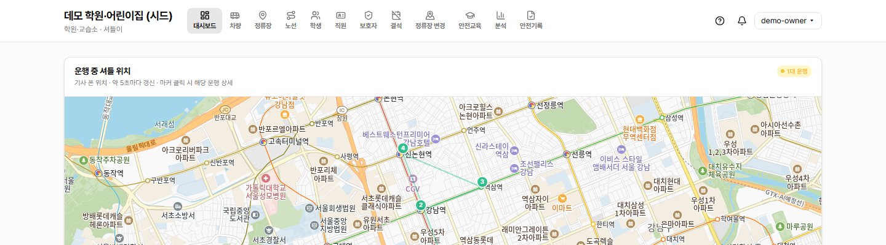
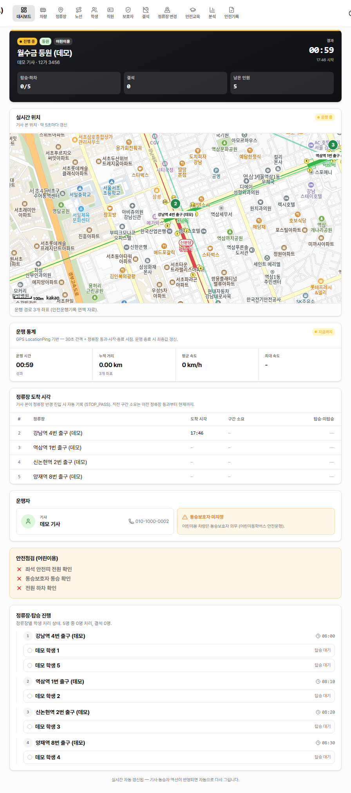

# 학원장·원장 사용 메뉴얼

셔틀이(Shuttlee) 학원·교습소·어린이집·유치원 운영자를 위한 종합 가이드.

> 📌 **이 메뉴얼이 다루는 범위**: 학원장 계정으로 가입한 시점부터 일상 운영(차량·정류장·노선·학생·직원·학부모 관리, 운행 모니터링, 안전운행기록, 안전교육)까지 모두.

## 목차

1. [시작하기](#1-시작하기)
2. [대시보드 둘러보기](#2-대시보드-둘러보기)
3. [차량 등록·관리](#3-차량-등록관리)
4. [정류장 등록·관리](#4-정류장-등록관리)
5. [노선 만들기](#5-노선-만들기)
6. [학생·원아 등록·노선 배정](#6-학생원아-등록노선-배정)
7. [직원(기사·동승자) 초대·관리](#7-직원기사동승자-초대관리)
8. [학부모 초대·관리](#8-학부모-초대관리)
9. [결석 요청 처리](#9-결석-요청-처리)
10. [정류장 변경 요청 처리](#10-정류장-변경-요청-처리)
11. [운행 모니터링](#11-운행-모니터링)
12. [운행 분석](#12-운행-분석)
13. [안전운행기록 PDF](#13-안전운행기록-pdf)
14. [안전교육 관리](#14-안전교육-관리)
15. [알림 설정](#15-알림-설정)

---

## 1. 시작하기

### 1.1 가입 및 로그인

학원·기관명·담당자 정보·이메일·비밀번호로 학원장 계정을 만듭니다.

1. 우측 상단 "시작하기" 또는 `/signup` 직접 접속
2. 학원·기관명, 담당자 이름, 이메일, 비밀번호 입력
3. 약관·개인정보처리방침 동의 → "가입"
4. 로그인 완료 시 자동으로 대시보드(`/dashboard`)로 이동

> 💡 **TIP**: 이메일은 비밀번호 재설정에 사용되므로 본인이 직접 받을 수 있는 주소로.

---

## 2. 대시보드 둘러보기

`/dashboard` — 실시간 운행 모니터, KPI 4종, 알림 sections.

### 2.1 운행 중 셔틀 라이브 지도

운행 중인 셔틀이 있으면 상단에 카카오맵으로 위치 마커가 5초마다 갱신됩니다.

### 2.2 KPI 카드 4종

- **오늘 운행** — 진행 중·예정·완료 합산
- **오늘 미탑승·미하차** — 학생이 정류장에 안 나옴/안 내림 보고
- **대기 요청** — 결석·정류장 변경 PENDING 합산
- **등록 자원** — 학생·차량·노선 수

### 2.3 운행 모니터·알림 sections

- 운행 모니터 카드 (진행 중·예정·완료)
- 30일 미탑승·미하차 잦은 학생 (3건 이상)
- 안전교육 만료 임박 직원
- 보험 만료 임박 어린이용 차량

---

## 3. 차량 등록·관리

`/vehicles` 목록 → "+ 새 차량"으로 등록.

### 3.1 차량 등록

1. **차량번호** 입력 (예: `12가 3456`)
2. **"어린이도 태우나요?"** — 13세 미만이 한 명이라도 타면 "예"
3. "예" → 어린이용 모드(KIDS), 보험 만료일 입력 필수

> ⚠️ **WARNING**: 도로교통법 §52는 **어린이가 한 명이라도 타면** 어린이통학버스 의무가 적용됩니다. 어린이·일반 병행 운영 차량도 KIDS로 등록해야 합니다.

### 3.2 차량 목록·360° 상세

행 클릭 → `/vehicles/[id]` 360° 상세:
- 30일 운행 통계 (운행 횟수, 누적 거리, 정류장 통과)
- 배정된 노선
- 안전점검 미흡 운행
- 보험 만료일 편집

---

## 4. 정류장 등록·관리

`/stops` 목록 → "+ 새 정류장".

### 4.1 정류장 등록

카카오맵에서 위치를 클릭하면 좌표가 자동으로 채워지고 주소가 reverse geocoding으로 표시됩니다.

1. 정류장 이름 입력 (예: "학원 앞", "신길역 3번출구")
2. 키워드 검색 또는 "내 위치" 버튼
3. 지도 클릭으로 위치 미세 조정
4. 반경 50m default (정류장 통과 자동 감지 범위)

> 💡 **TIP**: 데스크톱 브라우저는 GPS 정확도가 낮습니다 (WiFi/IP 기반 fallback). 스마트폰에서 등록하면 더 정확합니다.

### 4.2 정류장 목록·상세

행 클릭 → `/stops/[id]` 상세 (read-only 카카오맵, 사용 노선, 등하원 학생, 변경 요청 빈도).

---

## 5. 노선 만들기

`/routes/new`. 차량·방향(등원/하원)·요일·정류장 순서·학생을 정합니다.

### 5.1 노선 기본 정보

1. 노선 이름 (예: "월수금 등원 1코스")
2. **차량** 드롭다운 — 등록된 차량 중 선택
3. **방향** — 등원(정류장→기관) or 하원(기관→정류장)
4. **운행 요일** — 비트 선택 (월~일 + 공휴일)

### 5.2 정류장 순서 추가

1. 정류장 선택 + 예정 시각(HH:mm)
2. 순서대로 add
3. 학생 도착 예정 시각이 자녀 home 화면에 표시됨

---

## 6. 학생·원아 등록·노선 배정

### 6.1 학생 등록

1. 이름 입력
2. **학제·학년** 드롭다운 (미취학 만 3세 ~ 대학생·성인)
3. → 출생연도 자동 산출 + 어린이용 모드 대상 여부 자동 표시

### 6.2 학생 목록·360° 상세

행 클릭 → `/students/[id]` 360° (6개월 history, 결석·미탑승 빈도, 보호자, 노선·정류장 배정).

### 6.3 노선·정류장 배정

학생 편집 페이지(`/students/[id]/edit`)에서 노선·정류장 배정 섹션 추가.

---

## 7. 직원(기사·동승자) 초대·관리

### 7.1 직원 초대

1. 이름·역할(기사/동승자) 입력
2. "초대" 버튼 → 토큰 URL 자동 생성 (`/invite/[token]`)
3. 토큰 URL을 SMS·카카오톡으로 직원에 전달
4. 직원이 URL 접속 → loginId·비밀번호·복구 이메일 등록

### 7.2 직원 목록·상세

운행 통계, 안전교육 만기, 분석 페이지 cross-link.

---

## 8. 학부모 초대·관리

### 8.1 학부모 초대 (자녀 매핑)

자녀 학생을 먼저 등록한 뒤 학부모 초대 시 자녀 선택. 토큰 URL을 학부모에 전달.

### 8.2 학부모 목록·상세

자녀, 결석/변경 요청 history, 푸시 디바이스 진단.

---

## 9. 결석 요청 처리

`/absences` — 학부모가 신청한 결석을 PENDING → NOTIFIED_DRIVER → ACKNOWLEDGED 흐름으로 처리.

### 처리 흐름

1. 학부모 결석 신청 → PENDING
2. 학원장이 "기사에 전달" → NOTIFIED_DRIVER + 기사 폰에 알림
3. 기사가 운행 화면에서 학생 결석 표시 (자동 ACKNOWLEDGED)
4. 또는 학원장이 "반려" → REJECTED

---

## 10. 정류장 변경 요청 처리

`/stop-change-requests` — 학부모가 자녀 정류장 변경을 요청.

지도 미리보기로 변경 위치 확인 후 승인/반려.

---

## 11. 운행 모니터링

### 11.1 대시보드 운행 모니터

진행 중·예정·완료 카드. 클릭 시 상세 화면.

### 11.2 운행 상세 — 진행 중

실시간 GPS 마커, 정류장 진행도, 탑승·미탑승 보고.

### 11.3 운행 상세 — 종료 후

전체 경로 polyline, 누적 거리, 정류장 도착 시각, 안전점검 요약.

---

## 12. 운행 분석

`/dashboard/analytics` — 노선·기사별 운행 통계.

### 12.1 노선별 분석

평균 운행 시간, 평균 정류장 통과 분, 미탑승 빈도.

### 12.2 기사별 분석

운행 횟수, 평균 시간, 안전점검 완수율.

---

## 13. 안전운행기록 PDF

`/safety-report` — 분기별 안전운행기록(별지 제20호의2 서식) PDF 다운로드. **분기 종료 후 7일 이내 관할 경찰서 제출 의무.**

1. 분기 선택 (현재까지 운행 누적된 분기 목록)
2. "PDF 다운로드"
3. 차량별로 분리된 PDF — 좌석안전띠·동승보호자·하차 확인·누적 거리 자동 채움

> ⚠️ **WARNING**: 미제출 시 과태료 + 사고 시 면책 자료 무효화. 분기 종료 직후 다운로드 권장.

---

## 14. 안전교육 관리

`/training` — 운영자·기사·동승자의 안전교육 이수증 관리. 도로교통법상 2년마다 의무.

### 이수증 등록

1. 직원 선택 + 이수일·만료일
2. 이수증 PDF·이미지 업로드 (Supabase Storage)
3. 만료 30일 전 dashboard alert + 푸시 알림

---

## 15. 알림 설정

`/dashboard/notifications` — 푸시 알림 토글, 디바이스별 구독 상태.

학부모로부터 NO_SHOW 응답·정류장 변경 요청·결석 신청 등 push로 즉시 받음.
