# 학원장·원장 사용 메뉴얼

학원·교습소·어린이집·유치원 운영자(이하 **학원장**)을 위한 셔틀이 사용 안내서입니다. 가입한 시점부터 일상 운영(차량·정류장·노선·학생·직원·학부모 관리, 운행 모니터링, 안전운행기록 PDF 다운로드, 안전교육 관리)까지 모두 다룹니다.

> 📌 셔틀이가 처음이라면 위에서부터 차례로 따라오시면 됩니다. 익숙해진 뒤에는 목차에서 필요한 항목으로 바로 이동하세요.

## 목차

1. [가입과 첫 로그인](#1-가입과-첫-로그인)
2. [대시보드 둘러보기](#2-대시보드-둘러보기)
3. [차량 등록·관리](#3-차량-등록관리)
4. [정류장 등록·관리](#4-정류장-등록관리)
5. [노선 만들기](#5-노선-만들기)
6. [학생·원아 등록과 노선 배정](#6-학생원아-등록과-노선-배정)
7. [기사·동승보호자 초대](#7-기사동승보호자-초대)
8. [학부모 초대](#8-학부모-초대)
9. [결석 신청 처리](#9-결석-신청-처리)
10. [정류장 변경 요청 처리](#10-정류장-변경-요청-처리)
11. [실시간 운행 모니터링](#11-실시간-운행-모니터링)
12. [운행 분석](#12-운행-분석)
13. [안전운행기록 PDF (분기별 의무 제출)](#13-안전운행기록-pdf-분기별-의무-제출)
14. [안전교육 이수증 관리](#14-안전교육-이수증-관리)
15. [푸시 알림 설정](#15-푸시-알림-설정)

---

## 1. 가입과 첫 로그인

### 1.1 회원가입

새로 시작하는 학원·기관은 직접 회원가입을 합니다.

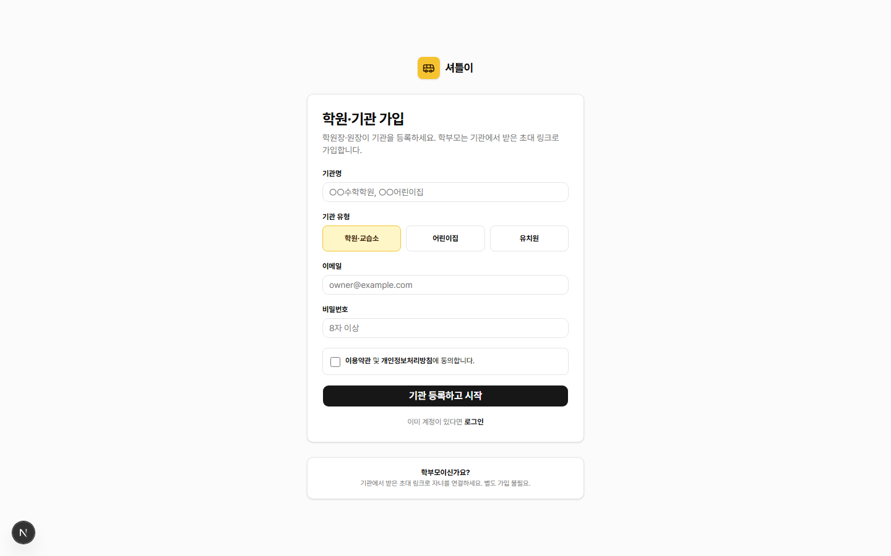

1. 셔틀이 홈페이지의 **시작하기** 버튼을 누릅니다.
2. **학원·기관명**, **담당자 이름**, **이메일**, **비밀번호**를 입력합니다.
3. 이용약관과 개인정보처리방침에 동의한 뒤 **가입** 버튼을 누릅니다.
4. 가입이 끝나면 자동으로 로그인되어 대시보드로 이동합니다.

> 💡 **이메일 선택**: 비밀번호를 잊었을 때 재설정 메일을 받는 주소입니다. 본인이 직접 받을 수 있는 주소를 사용해 주세요.

### 1.2 로그인 화면

다시 접속할 때는 로그인 화면에서 **이메일과 비밀번호**로 들어갑니다.

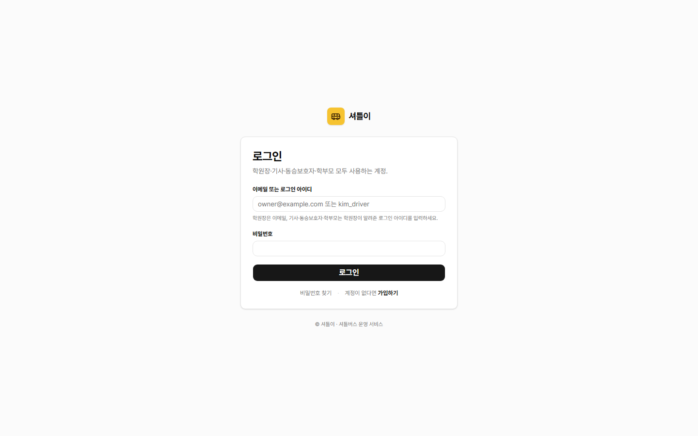

기사·동승보호자·학부모는 학원장이 알려드린 **로그인 아이디**(영문·숫자, 예: `kim_driver`)와 비밀번호로 로그인합니다.

---

## 2. 대시보드 둘러보기

대시보드는 셔틀이의 메인 화면입니다. 오늘의 운행 현황과 알림을 한눈에 확인할 수 있습니다.

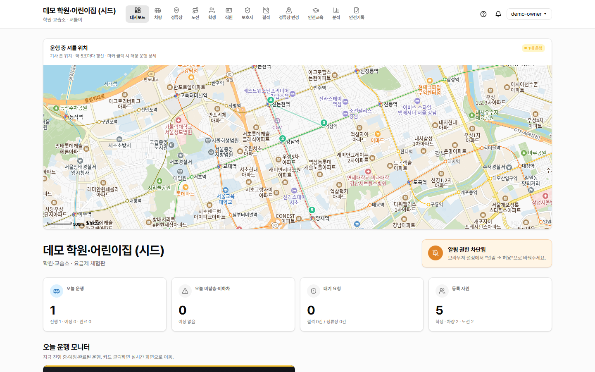

### 2.1 운행 중인 셔틀 위치 지도

운행 중인 차량이 있으면 화면 위쪽에 카카오맵으로 모든 셔틀의 위치가 동시에 표시됩니다. 지도는 약 5초마다 자동으로 갱신됩니다. 운행 중 차량이 없으면 지도 영역이 자동으로 숨겨집니다.

### 2.2 한눈에 보는 카드 4종

- **오늘 운행** — 오늘 진행 중·예정·완료된 운행 건수
- **오늘 미탑승·미하차** — 학생이 정류장에 안 나오거나 셔틀에서 안 내린 보고 건수
- **대기 요청** — 학부모가 보낸 결석 신청·정류장 변경 요청 중 아직 처리 안 한 건수
- **등록 자원** — 등록된 학생·차량·노선 수

### 2.3 필요할 때만 보이는 경고 카드

다음 상황에선 노란·빨간 경고 카드가 대시보드 아래쪽에 자동으로 표시됩니다.

- **최근 30일 미탑승·미하차 잦은 학생** — 3건 이상 누적된 학생 (보호자 면담을 검토하실 수 있도록 알려드립니다)
- **안전교육 만료 임박·미입력 직원** — 도로교통법상 운영자·기사·동승보호자는 2년마다 안전교육 이수 의무
- **보험 만료 임박 어린이용 차량** — 어린이통학버스 보험은 법정 의무

이 카드들은 해당 사항이 있을 때만 보이므로, 평상시 대시보드는 깔끔하게 유지됩니다.

---

## 3. 차량 등록·관리

학원·기관에서 운행할 셔틀버스를 등록합니다.

### 3.1 새 차량 등록

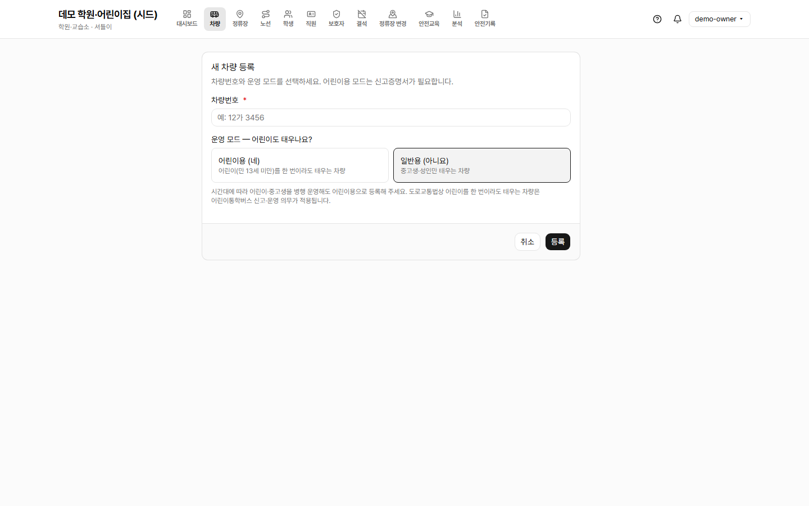

1. 좌측 메뉴 또는 상단 **차량** 탭에서 **+ 새 차량** 버튼을 누릅니다.
2. **차량번호**를 입력합니다 (예: `12가 3456`).
3. **"어린이도 태우나요?"** 질문에 답합니다.
   - 만 13세 미만 학생이 한 명이라도 탄다면 **"예"**를 선택 — 이후 어린이용 모드로 운영됩니다.
   - 어린이 일반(중·고생·성인)이 함께 타도 **"예"** 선택 — 도로교통법은 어린이가 한 명이라도 타면 어린이통학버스 의무를 적용합니다.
4. 어린이용 모드를 선택하면 **보험 만료일** 입력 칸이 나타납니다. 만료 30일 전에 대시보드 알림으로 안내됩니다.

> ⚠️ **법정 의무**: 어린이통학버스(어린이용 모드)는 도로교통법상 별도 의무사항(좌석안전띠·동승보호자·하차확인 등)이 적용됩니다. 본 메뉴얼의 "안전점검" 부분에서 다룹니다.

### 3.2 차량 목록과 상세 보기

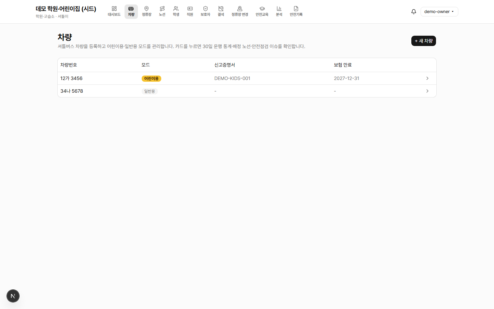

목록에서 차량 행을 누르면 **30일 운행 통계, 배정된 노선, 안전점검이 미흡했던 운행, 보험 만료일** 등을 한눈에 볼 수 있는 상세 화면으로 이동합니다.

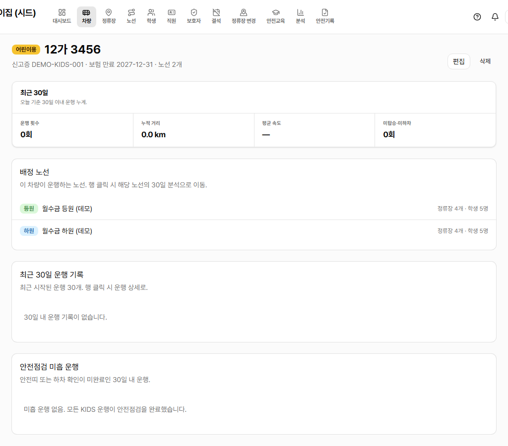

---

## 4. 정류장 등록·관리

학생들이 타고 내릴 정류장을 카카오맵으로 등록합니다.

### 4.1 새 정류장 등록

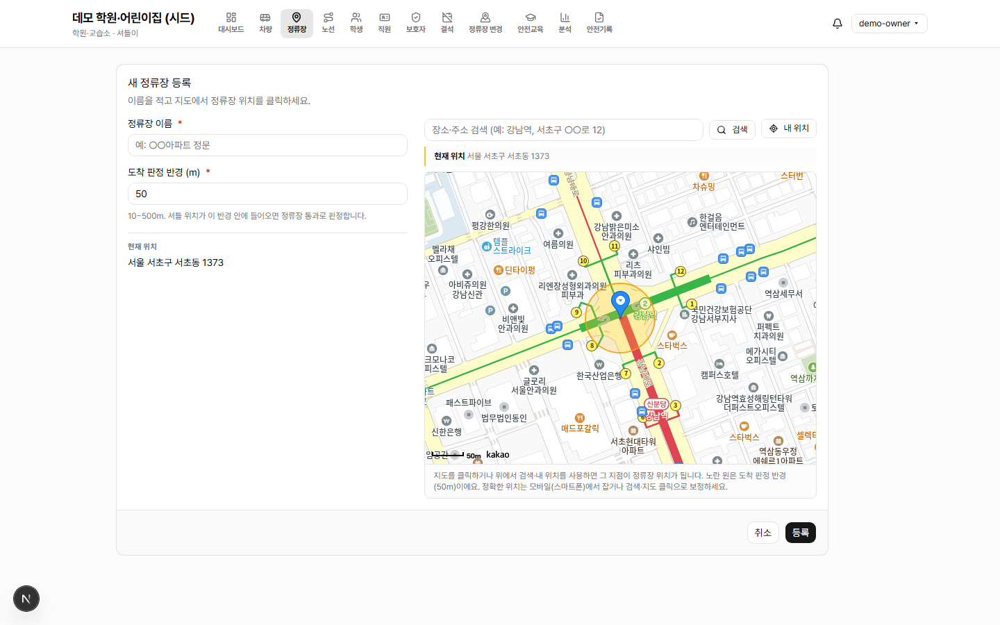

1. **정류장** 메뉴 → **+ 새 정류장**.
2. **이름**을 입력합니다 (예: "학원 앞", "신길역 3번출구").
3. **위치 정하기** — 다음 세 가지 중 편한 방법으로:
   - **키워드 검색** — 장소명이나 주소를 입력하면 카카오맵에서 후보 5개가 뜹니다.
   - **내 위치** — 지금 서 있는 위치로 자동 이동.
   - **지도 직접 클릭** — 지도를 보며 정확한 위치를 클릭.
4. 선택한 좌표는 자동으로 도로명·지번 주소로 변환되어 표시됩니다.
5. **반경**은 기본 50m입니다 — 셔틀이 이 반경 안에 들어오면 "정류장 통과"가 자동으로 감지됩니다.

> 💡 **데스크톱 위치 정확도**: 데스크톱 컴퓨터는 위성 신호(GPS) 없이 와이파이·인터넷 주소로 위치를 짐작하기 때문에 정확도가 낮습니다 (수십~수백 미터 오차). 스마트폰으로 등록하면 훨씬 정확합니다. 또는 검색·지도 클릭으로 보정해 주세요.

### 4.2 정류장 목록과 상세 보기

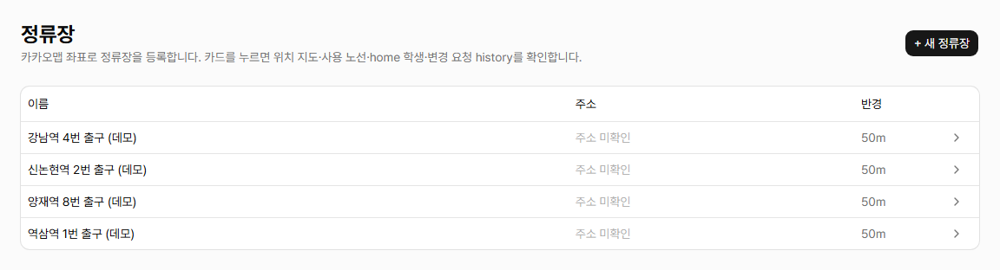

목록에서 정류장을 누르면 지도, 사용 중인 노선, 등하원 학생, 변경 요청 빈도까지 모두 확인할 수 있습니다.

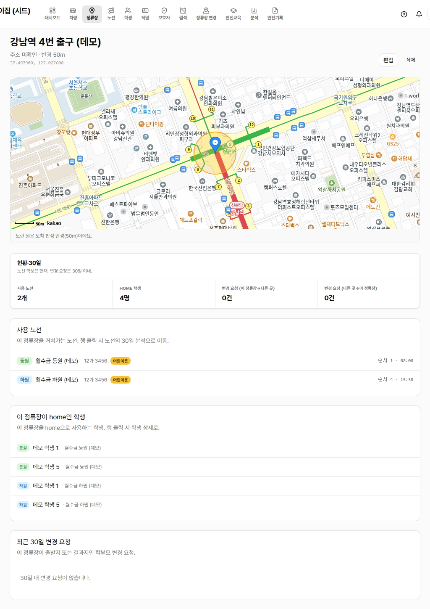

---

## 5. 노선 만들기

차량과 정류장을 등록한 뒤 **노선**(어떤 차량이 어떤 순서로 정류장을 도는지)을 만듭니다.

### 5.1 노선 기본 정보

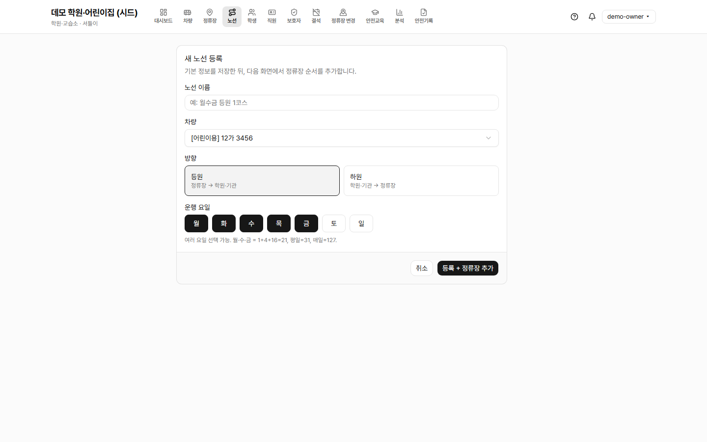

1. **노선 이름** 입력 (예: "월수금 등원 1코스").
2. **차량** 선택 (등록된 차량 중에서).
3. **방향** 선택:
   - **등원** — 정류장에서 학생을 태워 학원·기관으로
   - **하원** — 학원·기관에서 학생을 정류장에 내려줌
4. **운행 요일** 선택 — 월~일 중 운행하는 요일 모두 체크.

> 💡 등원과 하원은 별개의 노선입니다. 같은 차량으로 등원·하원을 모두 운영하려면 노선 두 개를 만들어 주세요.

### 5.2 정류장 순서 추가

노선을 만든 뒤에는 어떤 정류장을 어떤 순서로 들를지 정합니다.

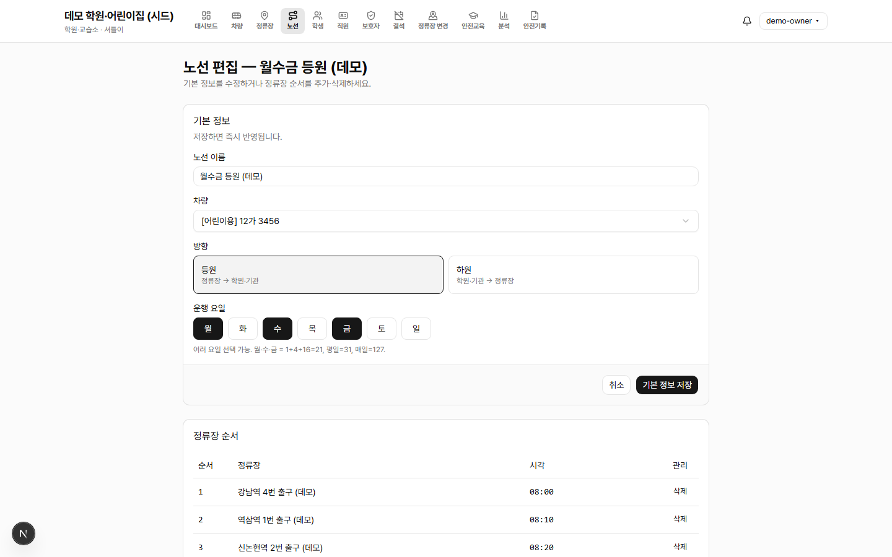

1. 정류장 선택 → 순서 번호 → 예정 도착 시각(예: `08:10`)을 입력하고 **추가**.
2. 학생들의 도착 예정 시각이 학부모 앱에 표시됩니다.

---

## 6. 학생·원아 등록과 노선 배정

### 6.1 학생 등록

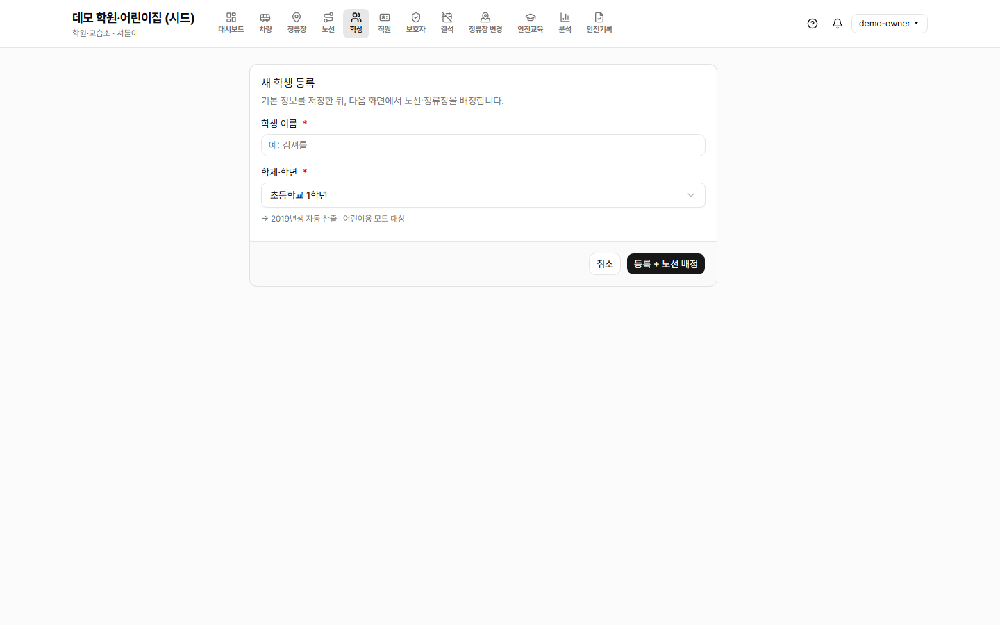

1. **이름** 입력.
2. **학제·학년** 드롭다운에서 선택 (미취학 만 3세부터 대학생·성인까지).
3. 선택과 동시에 **출생연도가 자동 산출**되고, 만 13세 미만이면 "어린이용 모드 대상"으로 자동 분류됩니다.
4. 어린이집·유치원이라면 화면에서 "학생" 대신 "원아"로 표시됩니다.

### 6.2 학생 목록과 상세 보기

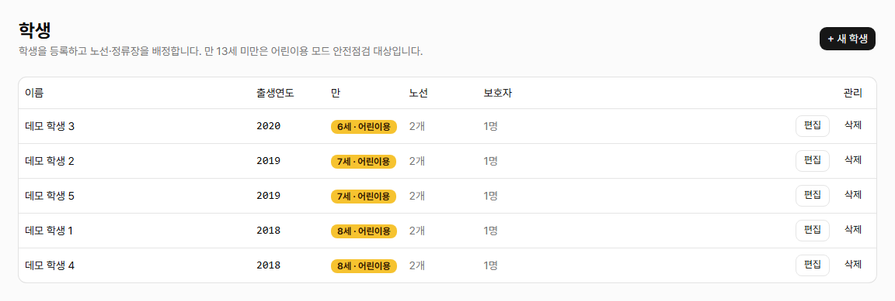

학생 이름을 누르면 **6개월 출결 history, 결석·미탑승 빈도, 보호자 정보, 노선·정류장 배정 현황**을 모두 볼 수 있는 360° 상세 화면이 나옵니다.

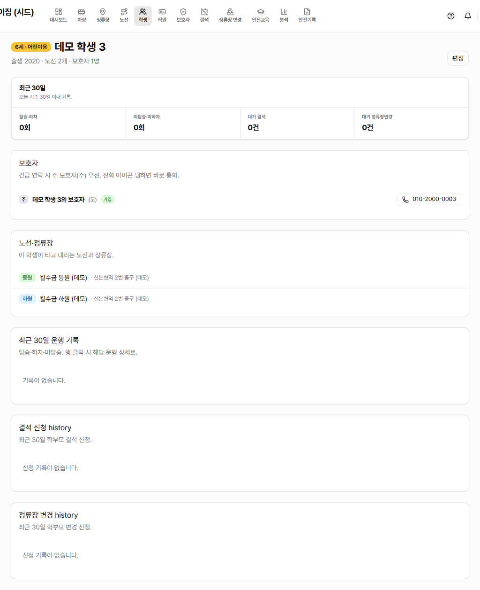

### 6.3 노선·정류장 배정

학생이 어떤 노선의 어떤 정류장에서 타고 내릴지 배정합니다. 학생 편집 화면 아래쪽에 배정 영역이 있습니다.

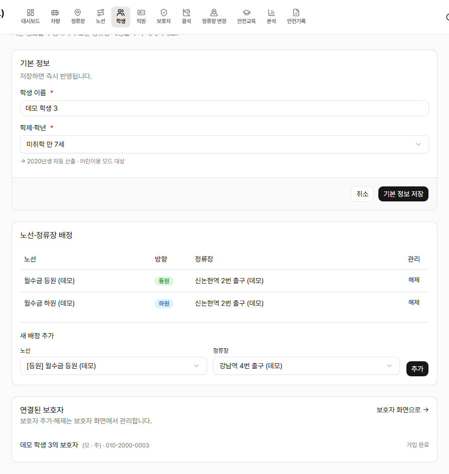

같은 학생이 등원·하원 노선 두 개에 모두 배정되는 게 일반적입니다.

---

## 7. 기사·동승보호자 초대

기사와 동승보호자(이하 **직원**)는 학원장이 보낸 **초대 링크**로 가입합니다. 별도의 회원가입 없이 한 번에 가입과 로그인이 처리됩니다.

### 7.1 초대 링크 발급

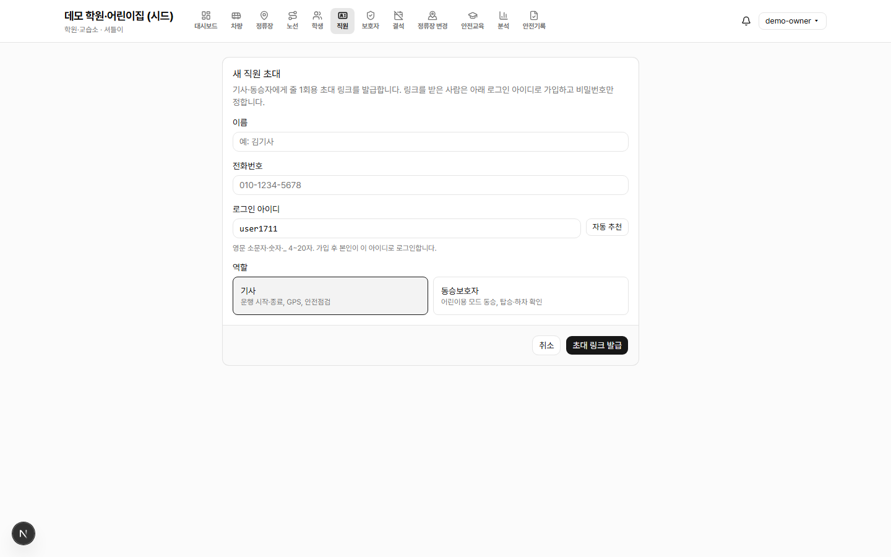

1. **직원** 메뉴 → **+ 직원 초대**.
2. 직원 이름과 역할(**기사** 또는 **동승보호자**)을 입력합니다.
3. **초대** 버튼을 누르면 **고유한 링크**(URL)가 만들어집니다.
4. 이 링크를 SMS·카카오톡 등으로 직원에게 직접 보내 주세요.
5. 직원은 링크를 누르고 **로그인 아이디·비밀번호·복구용 이메일(선택)**을 정해 가입합니다.

### 7.2 직원 목록과 상세 보기

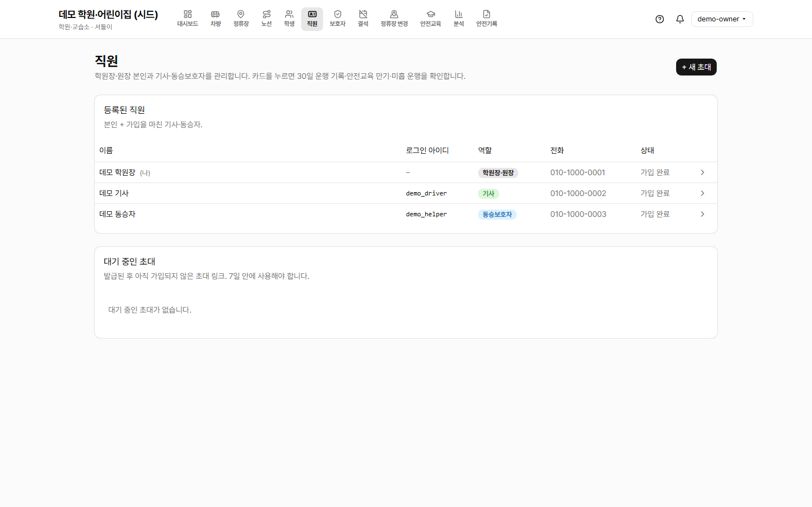

직원 이름을 누르면 **운행 횟수, 안전점검 완수율, 안전교육 만기일** 등 운영에 필요한 정보를 모두 볼 수 있습니다.

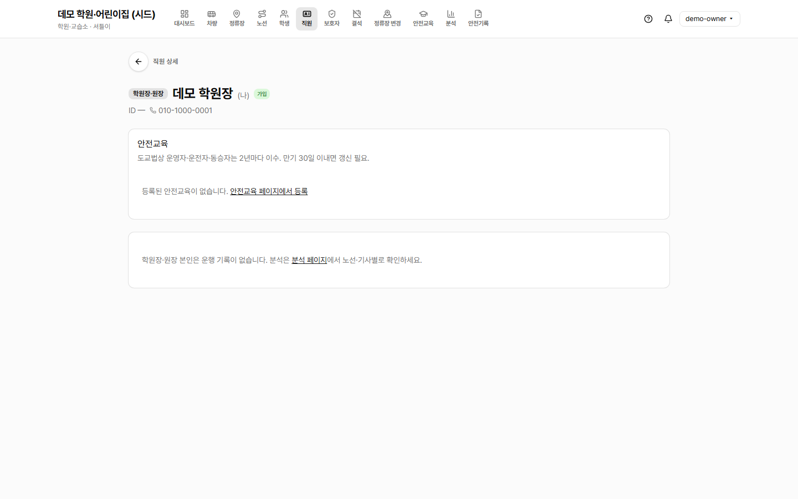

---

## 8. 학부모 초대

학부모도 같은 방식의 초대 링크로 가입합니다. 단, 학부모 초대는 **자녀 학생**과 1:1로 연결됩니다.

### 8.1 초대 링크 발급

자녀 학생을 먼저 등록한 뒤 학부모를 초대합니다.

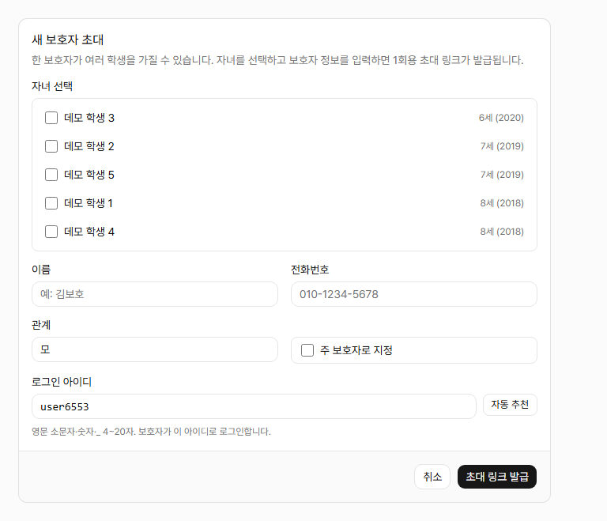

1. **학부모** 메뉴 → **+ 학부모 초대**.
2. 학부모 이름·전화번호 + 자녀 학생 선택 → 초대 링크 생성.
3. 링크를 학부모에게 SMS·카카오톡으로 전달.

### 8.2 학부모 목록과 상세 보기

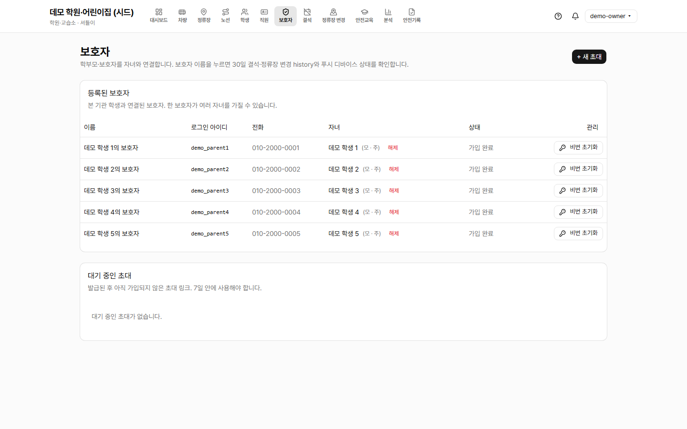

학부모 행을 누르면 **자녀 정보, 결석·정류장 변경 요청 history, 푸시 알림 디바이스 진단**까지 확인할 수 있습니다.

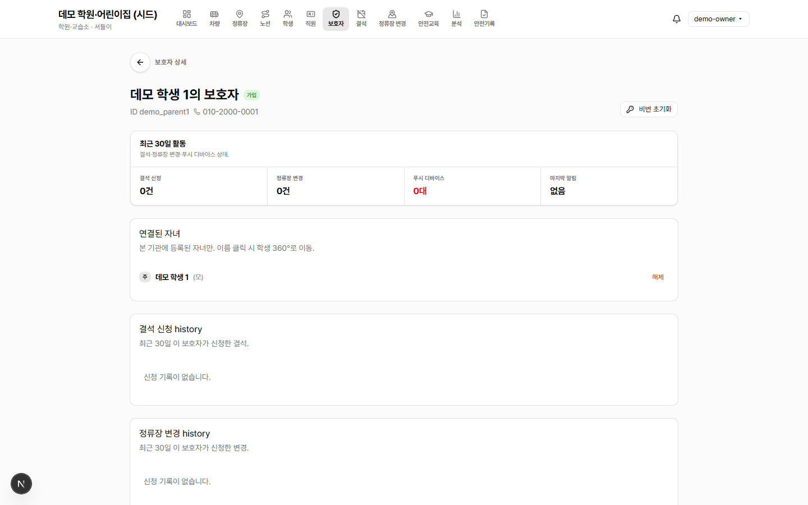

---

## 9. 결석 신청 처리

학부모가 자녀의 결석을 사전에 신청하면 학원장이 처리해야 합니다.

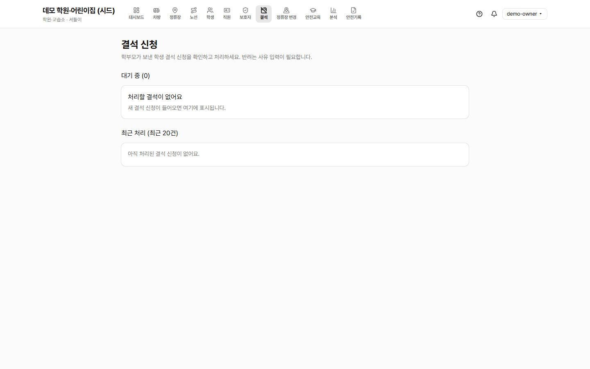

### 처리 흐름

1. **학부모가 결석 신청** → 상태: **대기**.
2. 학원장이 **"기사에 전달"** 버튼을 누름 → 상태: **기사에 전달됨** + 기사 폰에 자동 알림.
3. 기사가 운행 화면에서 학생 결석을 처리하면 → 상태: **확인됨** (자동).
4. 또는 학원장이 **"반려"** → 상태: **반려됨**.

> 💡 **반려 사례**: 학교 행사 등으로 셔틀 운행 자체가 없는 날은 결석 신청이 의미 없으니 반려.

---

## 10. 정류장 변경 요청 처리

학부모가 자녀의 정류장을 옮기고 싶을 때 보내는 요청을 처리합니다.

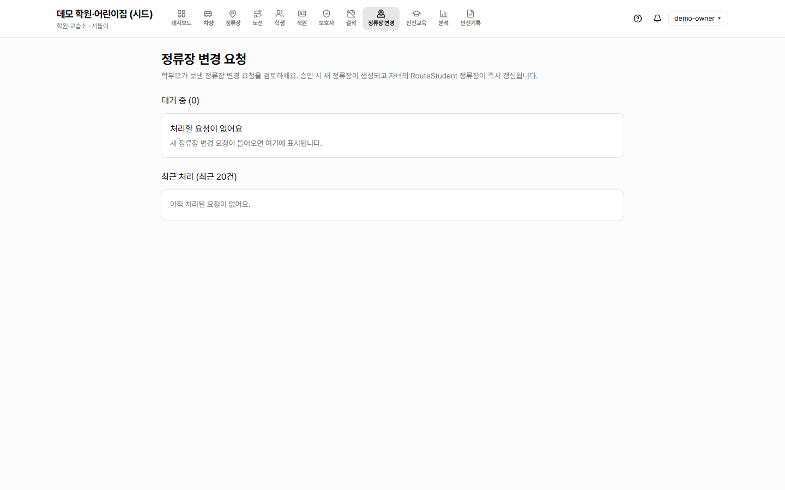

학부모가 지정한 새 위치를 **카카오맵 미리보기**로 확인한 뒤 **승인** 또는 **반려**를 선택합니다. 승인하면 지정한 적용 일자부터 다음 운행에 자동 반영됩니다.

---

## 11. 실시간 운행 모니터링

대시보드 가운데의 **오늘 운행 모니터**에서 진행 중·예정·완료된 운행을 한눈에 봅니다.

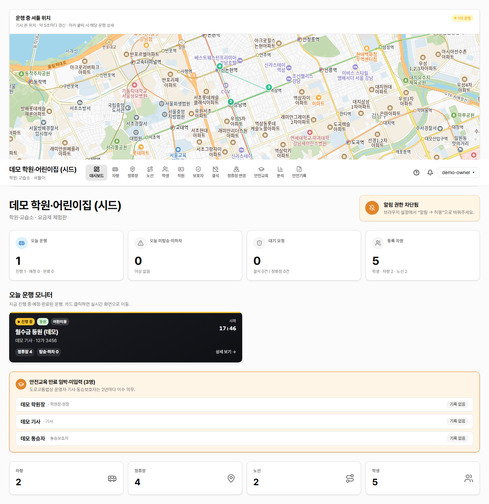

### 진행 중 운행 상세

운행 카드를 누르면 **실시간 GPS 지도, 정류장 진행도, 학생 탑승·미탑승 현황**을 볼 수 있는 상세 화면으로 이동합니다.

운행 종료 후에는 **전체 경로**, 누적 이동 거리, 정류장별 도착 시각, 안전점검 결과까지 모두 기록으로 남습니다.

---

## 12. 운행 분석

**분석** 메뉴(`/dashboard/analytics`)에서 누적된 운행 데이터의 통계를 확인합니다.

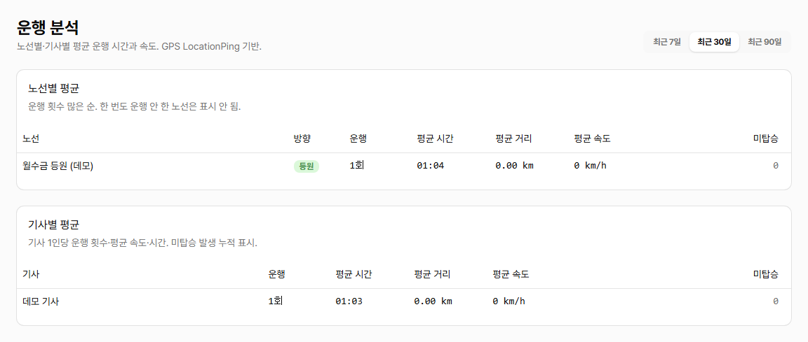

- **노선별 평균 운행 시간**
- **정류장별 평균 통과 시각**
- **기사별 운행 횟수·안전점검 완수율**

학생 미탑승 패턴, 노선의 정시성 등을 보고 노선·시각 조정에 활용하실 수 있습니다.

---

## 13. 안전운행기록 PDF (분기별 의무 제출)

도로교통법은 어린이통학버스 운영자가 **분기마다 안전운행기록**(별지 제20호의2 서식)을 작성해 관할 경찰서에 제출하도록 정합니다. 셔틀이는 매 운행의 좌석안전띠 확인·동승보호자 동승·하차 확인·누적 거리를 자동으로 누적하여 분기 종료 후 PDF 한 번으로 다운로드할 수 있게 해 드립니다.

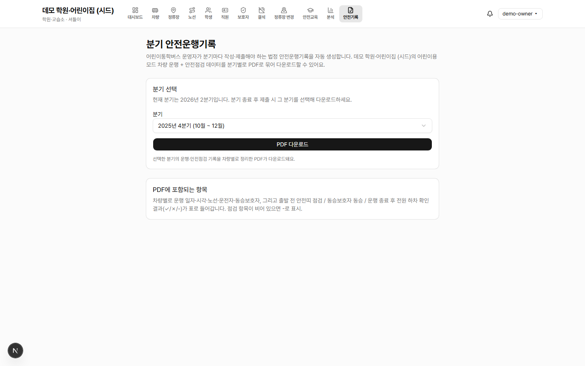

1. **안전운행기록** 메뉴 진입.
2. 분기 선택 → **PDF 다운로드**.
3. 차량별로 분리된 PDF가 만들어집니다.

> ⚠️ **미제출 시 과태료**: 분기 종료 후 7일 이내 제출이 원칙입니다. 미제출 시 과태료가 부과되며 사고 시 면책 자료로 인정되지 않습니다.

---

## 14. 안전교육 이수증 관리

운영자·기사·동승보호자는 **도로교통법상 2년마다 어린이통학버스 안전교육**을 이수해야 합니다.

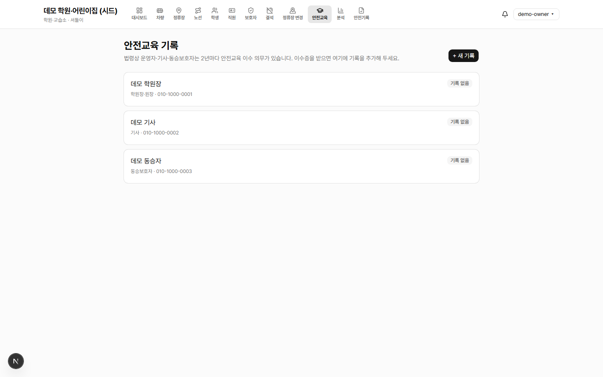

### 이수증 등록

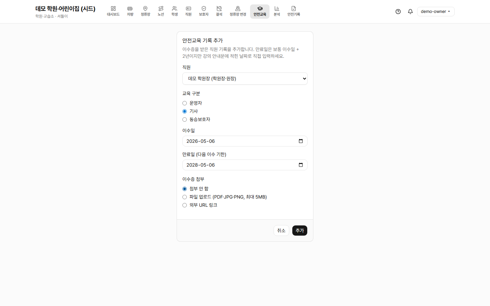

1. 직원 선택 → 이수일·만료일 입력.
2. 이수증 PDF 또는 사진 파일을 첨부 (최대 5MB).
3. 만료 30일 전에 대시보드와 푸시 알림으로 자동 안내됩니다.

---

## 15. 푸시 알림 설정

브라우저(또는 앱) 푸시 알림을 켜면 학부모의 결석 신청·정류장 변경 요청·기사의 미탑승 보고를 즉시 받아볼 수 있습니다.

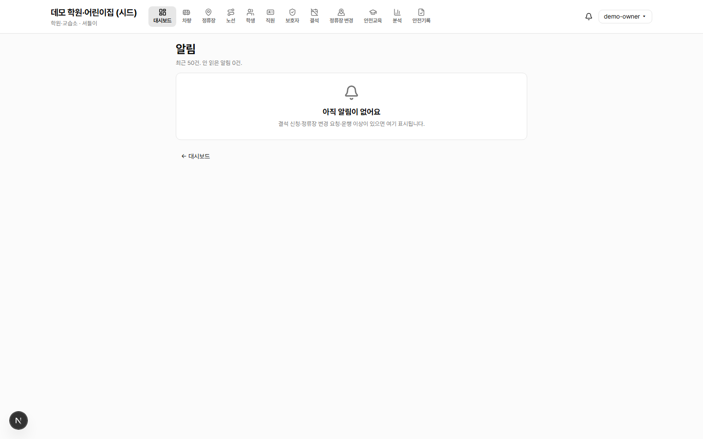

토글을 ON으로 바꾸면 브라우저가 권한 허용을 묻습니다. **허용**을 누르면 디바이스가 등록되고 알림이 도착합니다.

> 📌 **여러 기기 등록**: PC와 스마트폰 양쪽에서 알림을 받으려면 각 기기에서 따로 허용해 주세요.

---

문의·도움 요청은 학원이 발급한 셔틀이 계정의 담당 매니저에게 전달해 주세요. 추가 안내가 필요하면 본 메뉴얼이 갱신됩니다.
